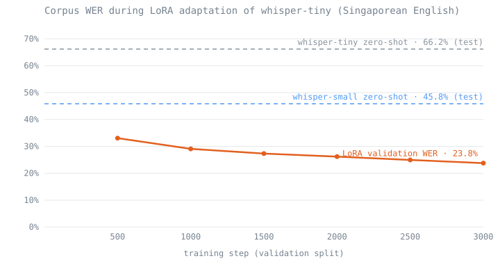

# Whisper for Singaporean English

[](https://github.com/arnav-goel10/whisper-singapore-english/actions/workflows/ci.yml)

LoRA adaptation of Whisper for Singaporean-accented English, with a word error
rate harness that treats corpus WER and mean per-utterance WER as the different
things they are.

The interesting result is not that fine-tuning helped. It is *how much* a 39M
parameter model can be moved by training 1.4% of it: after adaptation,
whisper-tiny scores better on this accent than whisper-small does untouched.

> **Evidence boundary:** the IMDA National Speech Corpus is licensed and is not
> redistributed here. This repository publishes code, aggregate metrics, and
> training logs. Audio and transcripts stay on the machine licensed to hold them
> and are supplied through a manifest.

## Results

| System | Condition | Split | Corpus WER |
| --- | --- | --- | --- |
| `openai/whisper-tiny` | zero-shot | test | 66.2% |
| `openai/whisper-small` | zero-shot | test | 45.8% |
| `openai/whisper-tiny` + LoRA, step 500 | fine-tuned | validation | 33.1% |
| `openai/whisper-tiny` + LoRA, step 3000 | fine-tuned | validation | **23.8%** |

The adapter trains **540,672 parameters**, about **1.4%** of whisper-tiny.



The chart is generated from the checked-in metrics by `scripts/make_wer_chart.py`; the curve is the validation split, the dashed baselines are the test split, as in the table above.

Two honest caveats. The fine-tuned figures are measured on the validation split
while the zero-shot baselines are measured on the test split, so the comparison
is indicative rather than controlled; `whisper-sg evaluate` exists to close that
gap by scoring the adapter on the test split directly. And validation WER was
still falling at step 3000, so this is where the run stopped, not where the model
converged.

Corpus WER is reported throughout: total edit distance divided by total
reference words. Mean per-utterance WER for the same predictions is 77.4% and
63.5% respectively, because averaging rates over utterances lets short
utterances dominate. Both are in
[`results/zero_shot_baselines.json`](results/zero_shot_baselines.json); the
metric definitions are in [the evaluation note](docs/evaluation.md).

## What it does

- **Corpus and per-utterance WER** from a single Levenshtein alignment, with
  substitutions, deletions, and insertions reported separately.
- **One normalization definition** applied to reference and hypothesis alike,
  covering case, punctuation, curly apostrophes, and the `**` markers IMDA uses
  for uncertain segments.
- **Manifest-driven evaluation** so licensed audio is referenced, never copied,
  and malformed rows are rejected before a model is loaded.
- **Architectural LoRA accounting**, so the parameter count is computed from
  model dimensions rather than quoted.
- **Model access behind a protocol**, so scoring is tested without torch and the
  baseline and adapter run through identical code.

## Quick start

Requires Python 3.10 or newer. The core installs with no ML dependencies:

```bash
python3 -m venv .venv
source .venv/bin/activate
python -m pip install -e '.[dev]'
pytest -q

whisper-sg adapter-size
```

To run a model you need the optional extra:

```bash
python -m pip install -e '.[asr,dev]'

# Zero-shot baseline
whisper-sg evaluate --manifest data/sample/manifest.csv --model-id openai/whisper-tiny \
  --split test --output results/baseline.json

# With a trained adapter
whisper-sg evaluate --manifest data/sample/manifest.csv --model-id openai/whisper-tiny \
  --adapter path/to/adapter --split test --output results/finetuned.json
```

## Manifest format

A UTF-8 CSV with `audio_id`, `audio_path`, and `transcript`. Relative paths
resolve against the manifest's own directory, so a manifest can sit beside the
audio it describes:

```csv
audio_id,audio_path,transcript
demo-0001,audio/demo-0001.wav,order one kaya toast and kopi c
```

The loader rejects missing columns, empty fields, and duplicate identifiers, and
optionally verifies every audio file exists before a model is loaded.

## Training configuration

| Setting | Value |
| --- | --- |
| Base model | `openai/whisper-tiny` |
| LoRA rank / alpha | 8 / 32 (scaling 4.0) |
| LoRA dropout | 0.1 |
| Target modules | `q_proj`, `k_proj`, `v_proj`, `out_proj`, `fc1`, `fc2` |
| Adapted layers | 4 encoder, 4 decoder |
| Bias | none |
| Steps | 3,000 |

Decoder layers carry cross-attention as well as self-attention, so they account
for more of the adapter than encoder layers do. `whisper-sg adapter-size`
prints the derivation.

## Quality gate

```bash
ruff check .
ruff format --check .
mypy
pytest -q
```

39 tests cover WER arithmetic against hand-computed answers, the corpus versus
per-utterance distinction, normalization, manifest validation, adapter sizing
against the released 540,672-parameter checkpoint, evaluation with a stub
transcriber, and the reported results themselves.

## Data

See [DATA_CARD.md](DATA_CARD.md). The checked-in manifest is three synthetic
rows for exercising the loader.

## Further reading

- [Architecture](docs/architecture.md): module boundaries and why the model sits
  behind a protocol.
- [Evaluation](docs/evaluation.md): metric definitions, normalization, and what
  the numbers do and do not support.

## License and security

Released under the [MIT License](LICENSE). Vulnerability reporting is described
in [SECURITY.md](SECURITY.md).
